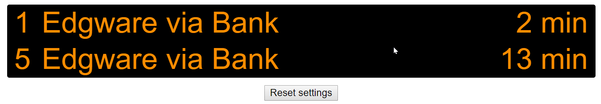

Emulates a typical arrivals board seen on London Underground platforms.

You will need an application ID and key to access the TfL API.

To set up:
1. Define your TfL credentials in src/credentials.json
2. `yarn install`
3. `yarn build`

On first run you will be prompted to select a station, line and direction.
These settings will be stored in local storage.